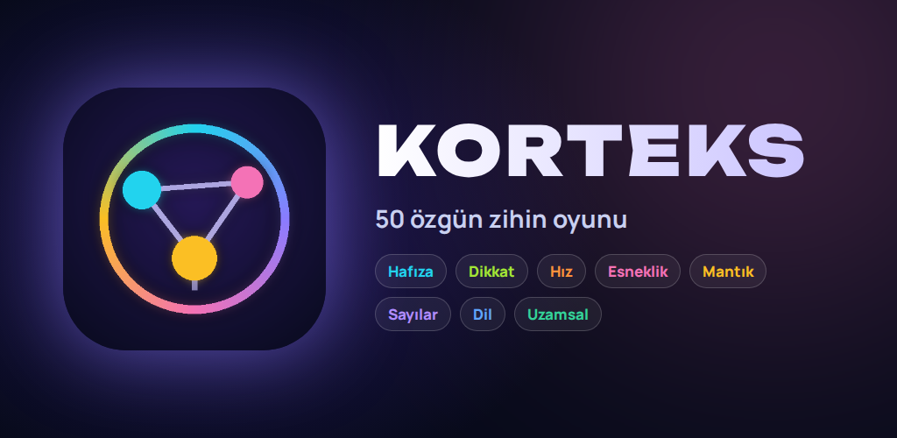
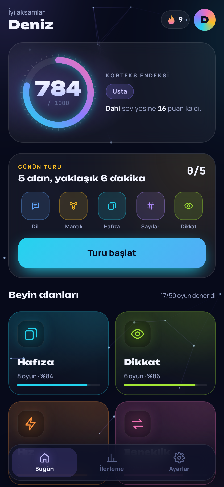
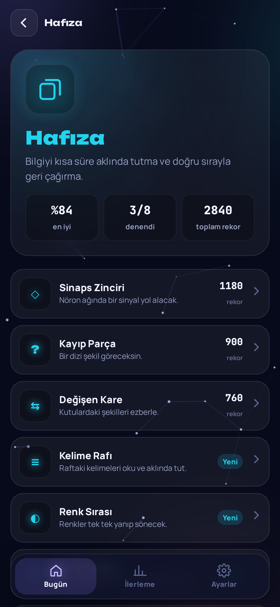
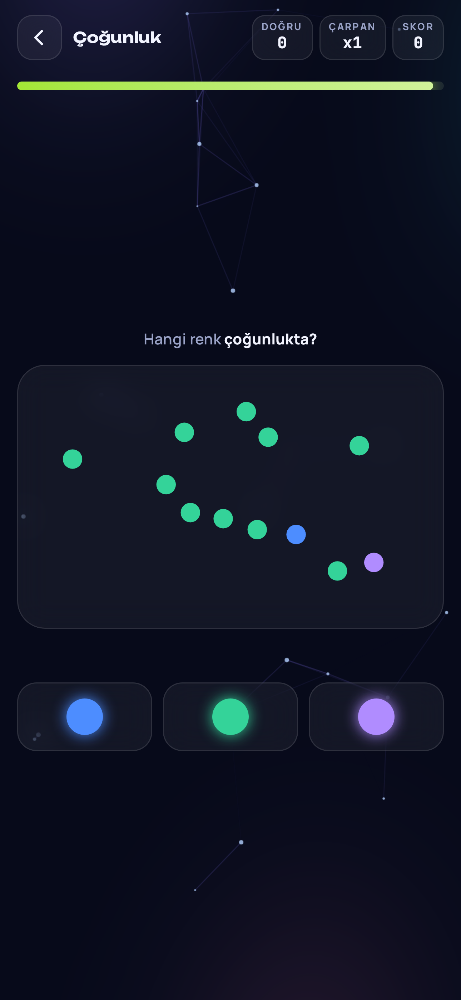
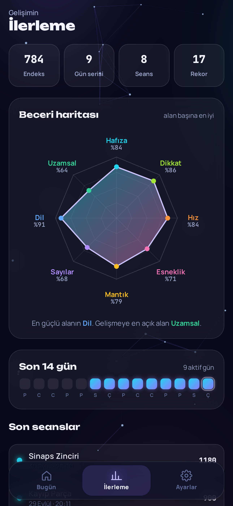

# KORTEKS

<p align="center"></p>

**8 beyin alanında 50 özgün zihin oyunu.** Telefon için tasarlanmış, çevrimdışı çalışan ve App Store / Google Play'e gönderilmeye hazır bir uygulama.

🌐 **Canlı sürüm:** https://bgelegen.github.io/korteks/

Hafıza, dikkat, hız, esneklik, mantık, sayılar, dil ve uzamsal düşünme becerilerini kısa oyunlarla çalıştırır. Oyunlar mevcut beyin antrenmanı uygulamalarından bağımsız olarak tasarlanmıştır.

## Ekranlar

<p align="center">
   
</p>

## Özellikler

- İlk açılışta karşılama ekranı ve kişiselleştirme
- 8 kategori sayfası; 50 oyun kategorilerinin içinde
- Alt sekme çubuğu: Bugün · İlerleme · Ayarlar
- **Korteks Endeksi** (0–1000) ve seviyeler: Çaylak → Gelişiyor → Keskin → Usta → Dahi
- Her gün değişen 5 oyunluk **Günün Beyin Turu**
- Gün serisi, rekorlar ve seans geçmişi
- Seri çarpanı, geri sayım, konfeti ve dokunsal geri bildirim
- Beceri haritası (radar grafik) ve son 14 günlük aktivite
- Ses efektleri ve titreşim (ayarlardan kapatılabilir)
- İnternetsiz çalışma (servis çalışanı + yerel fontlar), ana ekrana eklenebilir (PWA)
- Hesap, reklam ve takip yok; tüm veriler cihazda
- Hiçbir çalışma zamanı kütüphanesi veya derleme adımı gerektirmez

## Oyunlar

| Alan | Oyunlar |
|---|---|
| Hafıza | Sinaps Zinciri, Kayıp Parça, Değişen Kare, Kelime Rafı, Renk Sırası, Şifre Kasası, Tersten Sayı, Eşleşme İzi |
| Dikkat | Sinyal Avı, Tek Farklı, Harf Sayacı, Çoğunluk, Kod Kontrol, Hedef Arama |
| Hız | Refleks Işığı, Sıra Avcısı, Büyük Olan, Nokta Kalabalığı, Tam Zamanında, Işık Avı |
| Esneklik | Ters Akış, İkili Kural, Kuralı Bul, Ters İşlem, Karşıt Kutu |
| Mantık | Hedef Sayı, Örüntü Avcısı, Şekil Dizisi, Terazi, Sıralama Dedektifi, Denge Tablosu, Kesin mi? |
| Sayılar | Zincir Hesap, Kesir Düellosu, Yüzde Avcısı, Göz Kararı, Para Üstü, Kayıp İşaret, Sayı Doğrusu |
| Dil | Harf Karmaşası, Zıt Kutuplar, Yazım Dedektifi, Eş Anlam, Eksik Harf, Kelime Zinciri |
| Uzamsal | Ayna Dokunuş, Döndür Eşle, Pusula, Harita Yolu, Saat Kaç? |

Sinaps Zinciri ve Kuralı Bul, psikolojide kullanılan Corsi blok testi ile Wisconsin kart eşleme testinden esinlenmiştir.

## Çalıştırma

```bash
npm start        # http://localhost:5173 adresinde açar
```

Ya da `src/index.html` dosyasını doğrudan tarayıcıda aç.

## Test

```bash
npm install
npx playwright install chromium
npm test
```

Test; karşılama ekranından başlayıp tüm ekranları gezer, her oyunun soru üreticisini yüzlerce kez çalıştırıp cevapların geçerli olduğunu kontrol eder, ardından 50 oyunun hepsini açıp rastgele oynatarak hata arar.

## Proje yapısı

```
src/
  index.html            Sayfa iskeleti
  privacy.html          Gizlilik politikası
  manifest.webmanifest  PWA tanımı
  sw.js                 Çevrimdışı önbellek
  css/                  Stiller ve yerel font tanımları
  fonts/                Unbounded, Manrope, JetBrains Mono (woff2)
  icons/                Uygulama simgeleri
  js/core.js            Durum, ses, oyun kaydı, quiz ve tur motorları
  js/ui.js              Ekranlar ve yönlendirici
  js/words.js           Türkçe kelime listeleri
  js/games/*.js         Kategori başına bir dosya
  js/main.js            Başlatma, servis çalışanı, Android geri tuşu
scripts/                Önbellek listesi ve ekran görüntüsü üreticileri
store/                  Mağaza simgesi, öne çıkan görsel, ekran görüntüleri
docs/MAGAZA.md          App Store / Google Play yükleme rehberi ve mağaza metinleri
tests/smoke.mjs         Otomatik test
capacitor.config.json   Yerel uygulama kabuğu ayarları
```

## Mağazalara yükleme

Adım adım rehber ve hazır mağaza metinleri: **[docs/MAGAZA.md](docs/MAGAZA.md)**

## Yeni oyun eklemek

Uygun kategori dosyasına bir `def({...})` çağrısı ekle. Çoğu oyun hazır motorlardan birini kullanır:

```js
def({
  id: 'ornek', cat: 'sayi', gl: '+', name: 'Örnek Oyun', mode: 'quiz',
  desc: 'Oyunun kısa açıklaması.',
  gen(lv) {
    const a = ri(1, 9 * lv), b = ri(1, 9);
    return Object.assign(mk(a + b, near(a + b, 3, 4)), { q: `<div class="qmono">${a} + ${b}</div>` });
  },
});
```

- `mode: 'quiz'` — süreli, seri çarpanlı soru-cevap
- `mode: 'rounds'` — önce göster, sonra sor; 3 hak, seviye artar
- `mode: 'custom'` — `run(g)` ile tamamen özel oyun

## Yayın

`main` dalına her gönderimde GitHub Actions testleri çalıştırır ve geçerse uygulamayı GitHub Pages'e yayınlar. Depo ayarlarında **Settings → Pages → Source: GitHub Actions** seçili olmalıdır.
